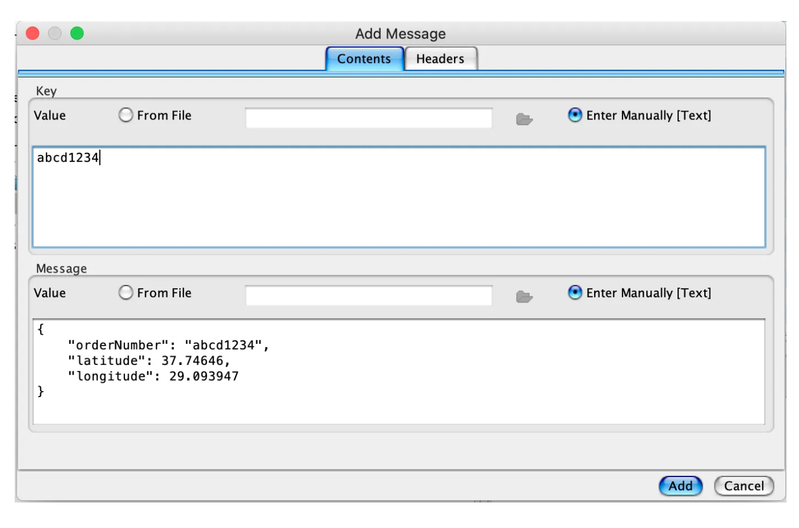

# Kafka Streams State Store Example

The definition of the repository is here.

## Requirements and Dependencies

- Kafka Cluster

- Java 21

- Spring Boot 3.3.0

- Spring Kafka Library

- application.yml
    ```
    kafka:
  bootstrapAddress: http://localhost:9092
  topics:
    msgOrderLocation:
      name: orderLocation
  streams:
    applicationId: orderLocationApplication
    stateStoreName: orderLocationStore
    ```

## Running the application

```./gradlew clean bootRun```

### Architecture


Add Message



Get Order Location


